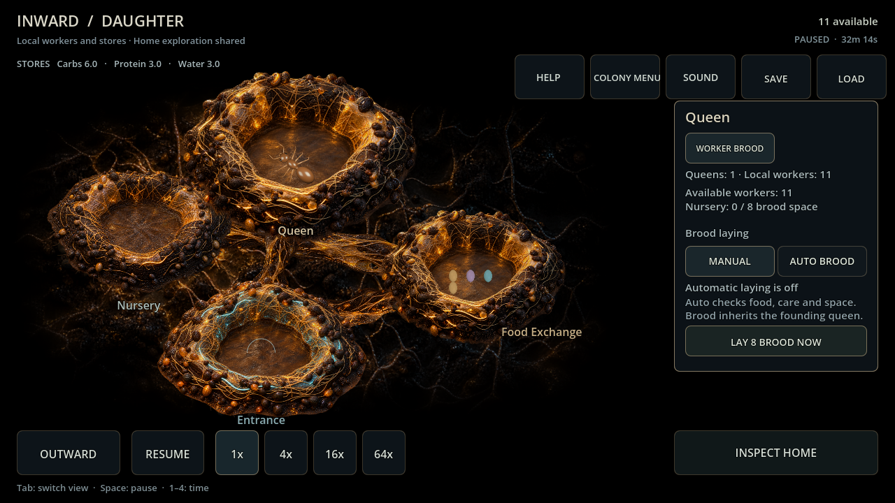
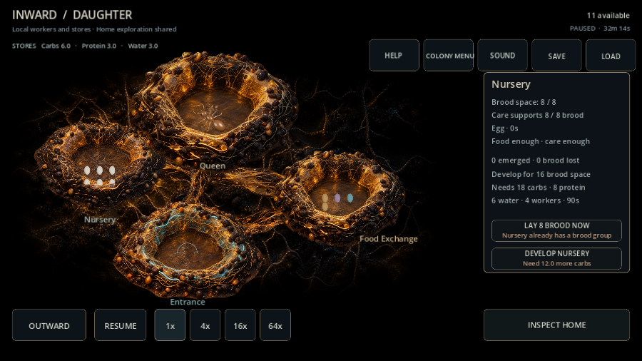

# First daughter pile — card 105

A returned ready founding camp can establish one daughter. Eleven physically present workers change ledger ownership; Home availability and death history stay unchanged. A supported daughter queen inherits its paid reproductive group’s earlier captured traits, separately from the adult settlers’ later expression. The daughter begins with primitive functions, 6 carbs / 3 protein / 3 water and zero invented brood. Initial colony-wide knowledge and simplified interior follow original Part 3 §89 and the first-satellite milestone.

| Ordinary camp continuation | Activation, simulated seconds | Home / daughter workers | Home available | Colony workers |
| --- | ---: | ---: | ---: | ---: |
| Backyard 482817 | 1933.5 | 66 / 11 | 32 | 77 |
| Backyard 591 | 2933 | 73 / 11 | 41 | 84 |
| Garden Edge 482817 | 2368.5 | 61 / 11 | 30 | 72 |
| Garden Edge 591 | 2137.5 | 64 / 11 | 30 | 75 |

All four start from card 104’s fresh ordinary, resource-paid saved camps; no population or resource injection. Local brood lays normally and spends food. After 300 seconds each still has eight larvae with 50 seconds of fed progress, no emergence, zero carbs and 1.2 protein. Water is zero or 3 according to actual rain; parent ecology continues. Every tick matches a JSON-restored twin. These are support-mechanism checks, not a balance/session-length verdict. [Raw evidence](evidence/card105_daughter.json). Reproduce after `tests/evaluate_founding.gd` with `tests/evaluate_daughter_pile.gd` using the pinned engine.

37 focused checks cover atomic activation, no duplicated workers/queens/supplies, old defaults, ledger overflow/unknown pools, overlapping adult trait bundles, imported expression without fictional births, immutable offspring lineage despite a later parent trial, finite local food stalls and strict rejected migration/foundation/route/clock saves. Final full suite: **6,417 checks, zero failures or script errors**. Import and 90-frame Main passed. Windows Godot 4.7.2 Compatibility / RX 6650 XT graphical probe exercised real mouse at 1280×720 and touch at 900×600 for activation, local laying, Home/daughter attention and Home OUTWARD. Frames inspected for clear local labels, simplified organ selection, readable contexts and nonoverlapping controls. No shutdown warnings.

Next: physically funded supply transport before calling the first satellite network complete. The existing founding route/segment becomes an inactive interpile connection; no cargo or transportation commitment is invented. Independent scouting, daughter lineage selection/reproductive generations, broader threats and multiple foundations remain later bounded work. Mobile and session targets are tabled.
