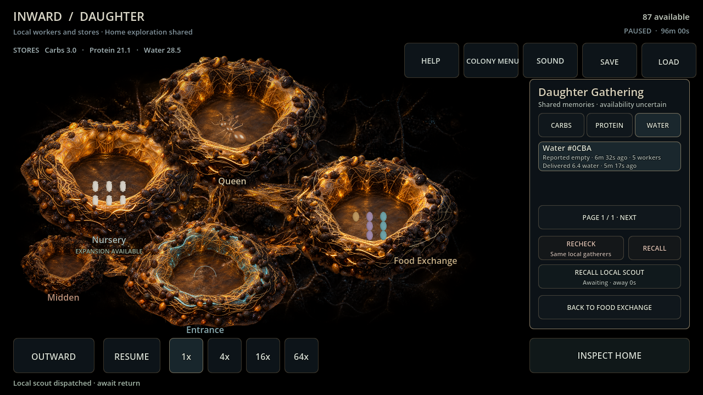
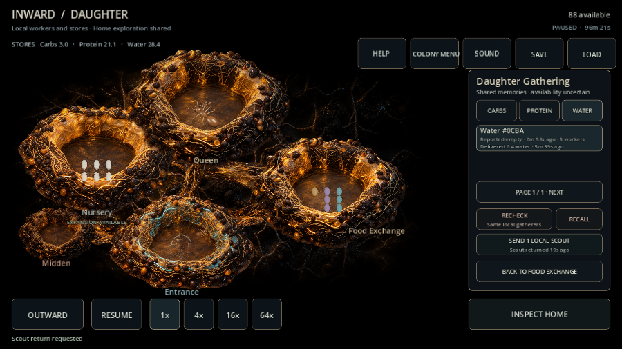

# Daughter scout rechecks — card 109

Selected shared source memories now offer one local scout, elapsed awaiting/overdue evidence, physical recall and dated returned/missing outcomes. The daughter's own worker and captured adult profile travel from its actual entrance; Home labor is unchanged. All individual scouts and trail-side detours retain the shared cap. No private position, phase, observation, arrival forecast or actual death is projected.

The ownership audit uncovered two prerequisites: fractional daughter entrances now physically join the cardinal grid via a short rounded-origin anchor, including strict outward/return saves; early recall no longer falsely reports an unvisited source empty. Optional departure target identity validates against known memory/active scout, while old departures preserve unknown identity.

Four ordinary paid card-108 daughters each sent a water recheck and then physically recalled a second mission shortly after departure. No workers/resources/memories were injected. Home effort was deliberately turned off and existing scouts recalled to free shared capacity; local rules/rates remained unchanged.

| Setting / seed | First recheck round trip | Second recalled trip | Exact phased saves |
| --- | ---: | ---: | --- |
| Backyard 482817 | 52.75 s | 2.25 s | yes |
| Backyard 591 | 53.75 s | 2.25 s | yes |
| Garden Edge 482817 | 37.25 s | 2.25 s | yes |
| Garden Edge 591 | 33.25 s | 2.5 s | yes |

All four retained the prior shared memory after early recall, returned their own worker and left no awaiting local mission. No new scout losses occurred on these ordinary water trips; focused ambush tests separately cover real daughter loss, delayed uncertainty, conserved profile/labor and exact continuation. [Raw report](evidence/card109_scouts.json). Reproduce ordinary evaluations 104→109 in order.

Verification: **74 focused checks**, including fractional travel, global cap, duplicates, legacy/forged target saves, private sensing, actual report/recall and delayed missing evidence. Final full suite **6,582 checks / zero failures or script errors**. Windows Godot 4.7.2 import/Main 90 passed. Compatibility / RX 6650 XT actual mouse 1280×720 and touch 900×600 passed dispatch/awaiting/recall/returned controls; frames inspected with clean shutdown. No mobile validation or broad balance/self-sufficiency claim.

