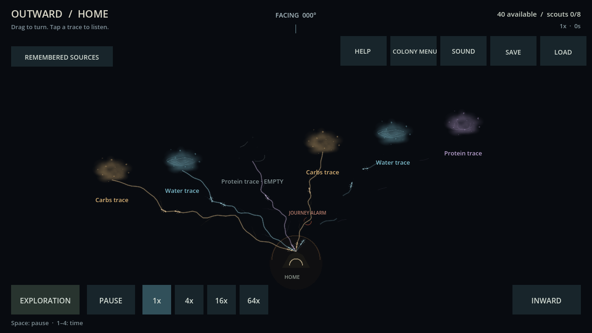
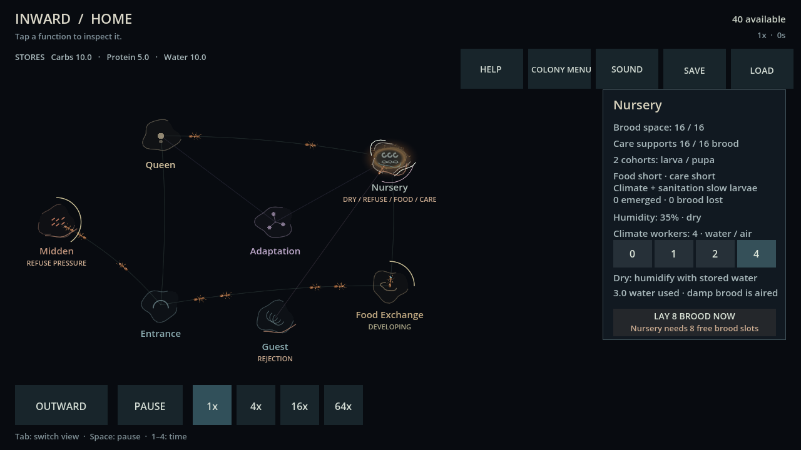

# Release-style graphics proof — Windows evidence

2026-10-02. Card 088. Baseline: `f3b29fd`; proof measured before its commit. Godot 4.7.2 Compatibility, Ryzen 7 7800X3D / Radeon RX 6650 XT, reported display refresh 240 Hz. Bloom absent. Original assets produced with Blender 5.2.2 LTS and committed SVG authoring sources.

## Method and limits

The same checked-in graphical probe ran sequentially against an ignored archive of the baseline commit and the proof checkout. Both used the final probe/fixtures; no Blender render ran during the clean comparison. Each case warms for 0.8 seconds and samples frame intervals for at least 2 seconds. Record sample counts, p50/p95/p99/worst, draw calls and engine texture-memory monitor in [raw observations](evidence/card088_graphics.json). These are short controlled desktop comparisons, not a soak test, separate GPU timings, input latency or release certification. Ambient desktop variability remains.

Quiet/normal/six-link OUTWARD and expanded INWARD isolate decorative rendering with the actual run paused; both authoritative snapshots/RNG stayed identical. Busy fixtures include strong/weak/ghost links, an empty source, returned alarm and six known internal jobs. Synthetic traffic stresses representation caps, not population simulation. The live 1×/16×/64× cases use natural quiet fresh colonies, not established busy colonies.

Standard captures are 1280×720, compact captures 900×506 within a requested 900×600 window, and larger captures 1920×1080. Logical presentation remains 1280×720. The engine texture-size accessor reports different scaled sizes for resized windows; retain those raw readings without equating them to physical GPU resolution. Identical resize order was used for both runs.

## Comparable unpaced intervals

| Workload | Baseline p95 ms | Proof p95 ms | Baseline/proof p99 ms | Baseline/proof draw calls |
| --- | ---: | ---: | ---: | ---: |
| quiet_outward | 0.462 | 0.443 | 0.555 / 0.490 | 39 / 39 |
| normal_outward | 1.789 | 1.547 | 1.963 / 1.704 | 194 / 187 |
| stress_outward_1280 | 3.277 | 2.498 | 3.636 / 3.035 | 382 / 331 |
| stress_outward_900 | 3.031 | 2.996 | 3.775 / 3.410 | 382 / 331 |
| stress_outward_1920 | 2.854 | 2.132 | 3.391 / 2.704 | 382 / 331 |
| stress_inward_1280 | 1.792 | 1.411 | 1.921 / 1.544 | 237 / 191 |
| stress_inward_900 | 1.631 | 1.331 | 1.839 / 1.487 | 231 / 187 |
| stress_inward_1920 | 1.720 | 1.346 | 1.852 / 1.484 | 237 / 187 |
| live_1x | 0.488 | 0.485 | 0.543 / 0.527 | 39 / 39 |
| live_16x | 0.460 | 0.471 | 0.508 / 0.521 | 39 / 39 |
| live_64x | 0.470 | 0.471 | 0.532 / 0.529 | 39 / 39 |

Default VSync: stress OUTWARD p50 4.146 → 4.167 ms, p95 4.415 → 4.273 ms. This is consistent with the current 240 Hz display; card 047’s earlier ~35 ms intervals did not reproduce. No pacing fix is claimed.

Texture-memory monitor increased by approximately **3.20 MiB** for the shared atlases/masks/vignette at the standard workload. More detailed ants/clouds reduce immediate primitive drawing; cached route shapes avoid repeated geometry generation. Results support continuing this technique on this desktop, not raising representative caps or assuming phones have the same headroom.

## Visual and functional evidence

- Inspected worker atlas anatomy and walk poses, standard/compact OUTWARD and INWARD captures, uncertain/clear/empty water, and label reserves. Earthen art is intentionally limited to Nursery; other chamber artwork and object-specific reports are next scope.
- New ant bounds protect captions/context. Shared hit areas and selection semantics are unchanged; existing automated mouse/touch contracts passed. No physical Android touch playtest was run.
- Targeted art suite: 88 checks, zero failures. Final full suite: 5979 checks, zero failures. Final import and 90-frame headless Main smoke exited zero with no script/resource failures. Existing sandbox log/editor-settings/certificate warnings remain environmental.
- The corrected graphical probe completed all cases without script errors and confirmed decorative snapshot equality. An initial incomplete stress dictionary was repaired before the clean measurements; its erroneous run was discarded.

Additional captures: [compact OUTWARD](evidence/card088_outward_900.png), [compact INWARD](evidence/card088_inward_900.png), [uncertain water](evidence/card088_water_uncertain.png), [clear water](evidence/card088_water_clear.png).

## Next boundary

Expand reported target impressions and functional chamber art only as bounded cards, reusing these measurements. Separate source identity from location confidence before showing a specific remotely remembered object. Minimum Windows/Android hardware remains undecided; real mobile performance, thermal behavior, release-export timings, long-session memory and richer live-colony stress remain unverified. Provisional 60 FPS desktop / 30 FPS lower-end Android goals are not achieved-device claims. The 20–30-minute gameplay target remains tabled.
