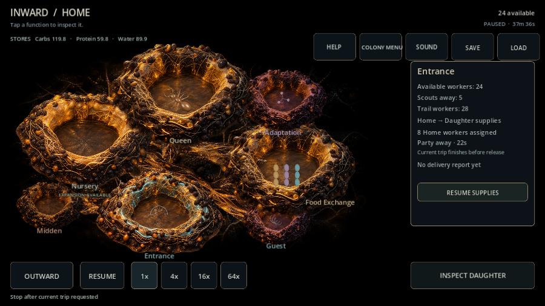
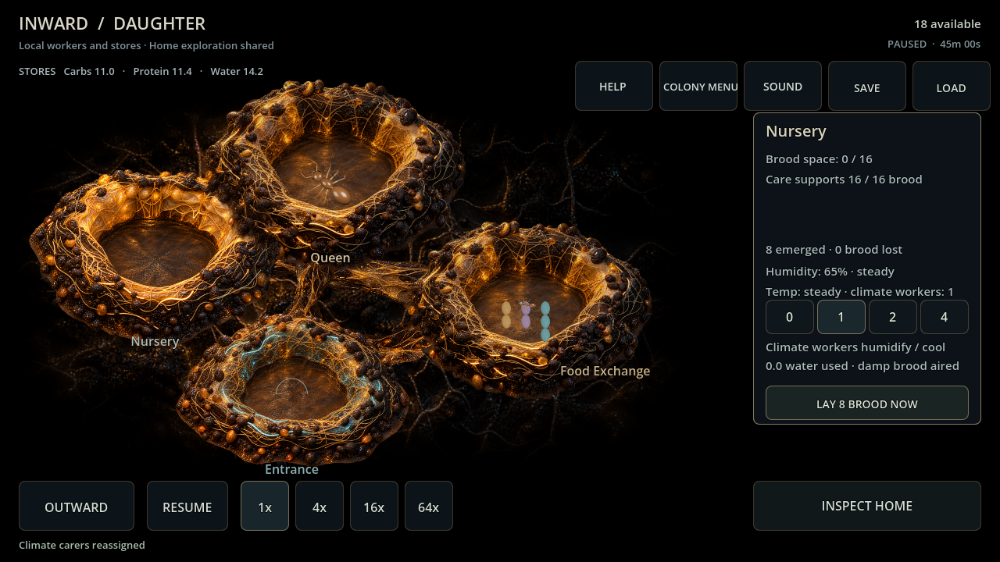

# Supported daughter growth — card 106

An eight-worker Home party repeatedly carries mixed packs through the original founding route/segment. Cargo and round-trip travel food are debited at departure; packs deposit only at daughter arrival. Home learns delivery/pheromone reinforcement when workers physically return. Stop After Trip completes committed transit before release; a waiting unfunded party releases immediately. Base 4 carbs/2 protein/2 water responds to actual Carry/Lean/Persistent travel modifiers and preserves cargo contamination. No worker migration beyond the original settlers, copied stores or instantaneous cargo.

Four ordinary card-105 camp continuations begin with genuinely food-stalled larvae. Existing Home source/recheck/care policy continues; every new chamber/transport action pays real stores and workers. No injected resources/population.

| Scenario / seed | Support begins | First local emergence | Nursery + Food Exchange developed | Daughter adults | Returned packs |
| --- | ---: | ---: | ---: | ---: | ---: |
| Backyard 482817 | 2233.5s | 2395s | 2700s | 19 | 10 |
| Backyard 591 | 3233s | 3395s | 3790s | 19 | 10 |
| Garden Edge 482817 | 2668.5s | 2830s | 3135s | 19 | 10 |
| Garden Edge 591 | 2437.5s | 2600s | 2895s | 19 | 10 |

Each daughter has eleven original settlers plus eight locally emerged adults, no adult losses in these runs. Ten returned packets report roughly 43.75–45.31 carbs and half as much protein/water of each kind. Final daughter stores remain local; rain, feeding, travel, projects and climate retain existing rules. These runs prove support/growth/development, not session length or long-term balance. Outbound, returning, waiting and developed snapshots each match a JSON-restored continuation. [Raw report](evidence/card106_supply.json). Reproduce the 104→105→106 ordinary evaluation scripts in order using pinned Godot.

Focused verification: **38 behavioral checks**, including real transit/deferred release, known Home shortages, contamination share/deposit-once, captured trait modifiers, malformed cargo/trip/receipt/orphan rejection, old defaults, repeated fed emergence, all time speeds/pause and identical summaries for different private travel phases. Final full headless suite: **6,456 checks, zero failures/script errors**. Windows Godot 4.7.2 import and 90-frame Main passed. Compatibility / RX 6650 XT graphical probe passed actual mouse at 1280×720 and touch at 900×600: standing order, unknown away result, stop/resume, shortage→Entrance attention, developed daughter art and one local climate worker without changing Home. Frames inspected; no shutdown warnings. Owned multi-resource receipts are normalized from integer histories/captured last packs after validation to preserve exact continuation despite JSON sum rounding.

First supported satellite milestone is functional. Broader independence, reinforcements, transport casualties/threats, full reproductive lineages, multiple sites and abandonment remain later. Initial shared colony knowledge/simplified interior remains permitted; private transport direction/arrival never appears in Home reports. Mobile and session targets remain tabled.
