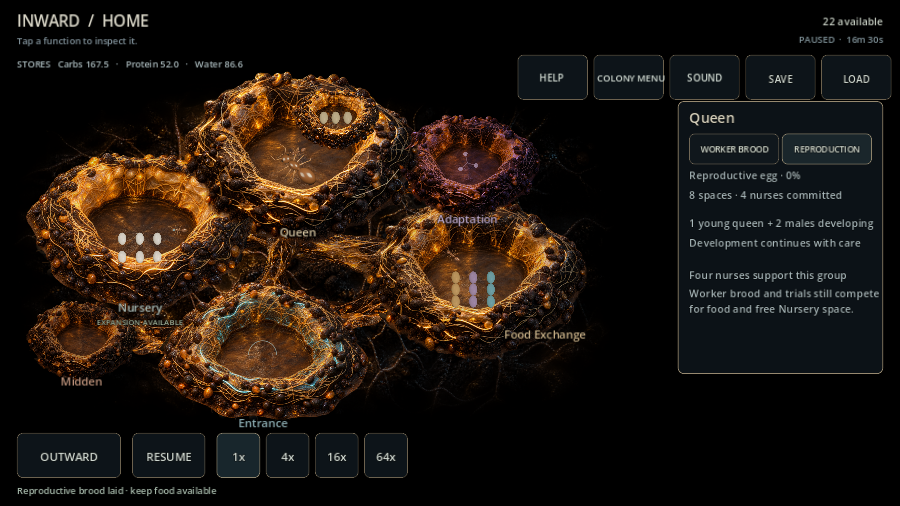
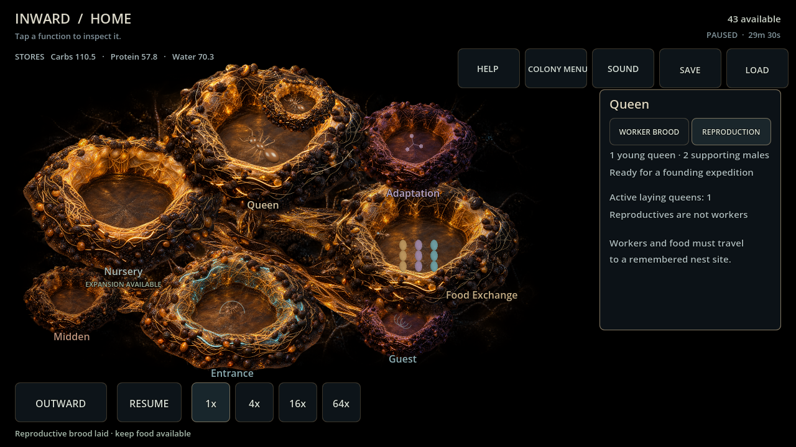

# Reproductive investment evaluation

Godot 4.7.2, Windows desktop Compatibility / AMD RX 6650 XT. Four fresh ordinary colonies used returned source decisions, paid gathering/chambers/adaptations, guest rejection, producer tending, cleanup and climate care. After 32 emerged workers the policy saves a brood opportunity for reproductives. No worker/resource injection or hidden source selection. Ten-second policy-free JSON continuation windows at egg, larva, pupa and ready compared every tick exactly.

| Setting / seed | Laid (s) | Ready (s) | Development (s) | Final workers | Active queens |
| --- | ---: | ---: | ---: | ---: | ---: |
| backyard_slice / 482817 | 990.0 | 1770.0 | 780.0 | 77 | 1 |
| backyard_slice / 591 | 1450.0 | 2768.75 | 1318.75 | 85 | 1 |
| garden_edge / 482817 | 1425.0 | 2205.0 | 780.0 | 74 | 1 |
| garden_edge / 591 | 1195.0 | 1975.0 | 780.0 | 75 | 1 |

All four preserved ledger invariants and exact saves, found eight nodes, and released reproductive nurses on ready. Three groups completed the 780-second fed schedule; one took longer through actual food waiting. This verifies affordability/continuation, not a final rate or session-length target.

Final full suite: 6,341 checks, zero failures/script errors. Import and 90-frame Main passed. Actual mouse/touch free tab attention and paid laying passed at 1280×720/900×600; paused state stayed fixed. Visual review corrected compact text overflow. Graphical probe reports eight ObjectDB instances leaked at shutdown, with no runtime/script errors. Human playtesting remains open; mobile work is tabled.

[Raw ordinary trials](evidence/card103_reproduction.json).

Boundary: one aggregate group, no adult upkeep or reproductive mortality, mating/flight simulation, fertile establishment, pile creation, or retrofit of worker-trial adaptation. Ready young queens are preparation for the next physical expedition.
