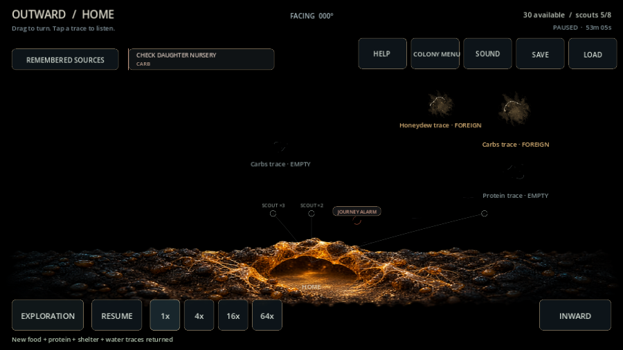
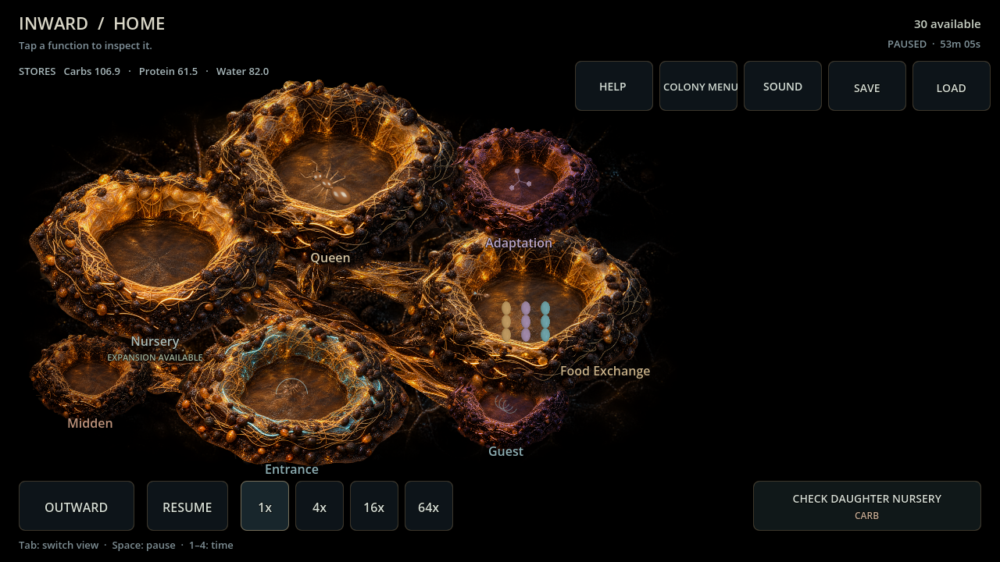

# Sustained satellite review — card 107

Continued four ordinary, resource-paid developed daughters for another 1,800 simulated seconds, each with standing Home supplies and a paired Stop After Trip branch. Both use existing local Grow, one climate worker and one cleanup worker; the stopped branch deliberately lays one paid cohort manually before reserve waiting. Home continues its known-source policy. No population, resources or knowledge injected. This is a sustained-system comparison, not a session target or rate rebalance.

| Setting / seed | Supported adults / local births | Stopped adults / local births | Supported returned packs | Stopped returned packs |
| --- | ---: | ---: | ---: | ---: |
| Backyard 482817 | 83 / 72 | 27 / 16 | 38 | 11 |
| Backyard 591 | 75 / 64 | 27 / 16 | 40 | 11 |
| Garden Edge 482817 | 83 / 72 | 27 / 16 | 35 | 11 |
| Garden Edge 591 | 83 / 72 | 19 / 8 | 42 | 11 |

Eleven original settlers plus local births reconcile exactly. All eight daughters have zero observed adult/brood losses here, nonnegative stores and exact JSON-restored continuations at repeated checkpoints. Supported daughters paid for Midden development and remained locally cared for. Stopped daughters exhausted their usable carbohydrate reserve; one manually laid cohort stalled. Support does not guarantee uninterrupted feeding: Backyard 591 briefly ran short while funding local development, then recovered. [Raw report](evidence/card107_review.json). Reproduce the ordinary 104→105→106 evaluations, then `tests/evaluate_supported_daughter.gd`.

Before this change, the two observed larval food shortages produced no Home attention. Grow's deliberate reserve gate also remained invisible outside the daughter's Queen. The existing INWARD pile switch now names known pressure and opens its affected function; OUTWARD has an optional named daughter check, with a separate target when Home also needs attention. Grow waiting opens Queen and says reserve/care waiting, never starvation or a future forecast. Sources/Exploration shield the extra badge; navigation is voluntary, free, usable paused and revalidated against current local facts. Initial colony-wide internal knowledge remains the accepted original-design simplification. Private supply arrival/direction and exterior truth are excluded.

Verification: twenty new behavioral checks, 32 with existing Home attention; final full suite **6,477 checks / zero failures or script errors**. Godot 4.7.2 Windows import and Main 90 passed. Compatibility / RX 6650 XT actual mouse at 1280×720 and touch at 900×600 verified food-strain and reserve-wait navigation without simulation mutation; inspected rendered frames and clean shutdown. No claim about Android/human usability or general long-term balance.

