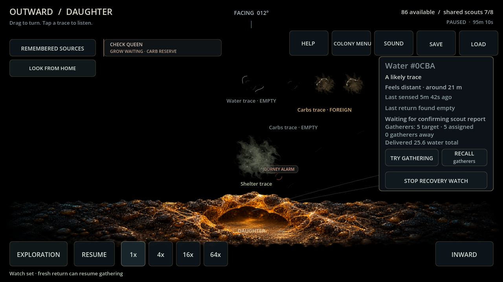
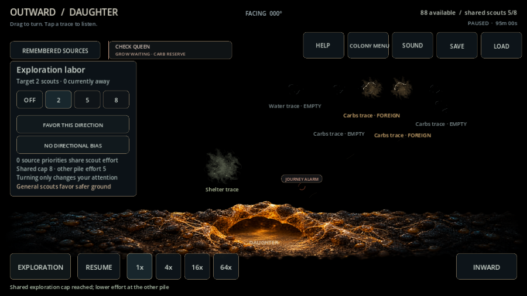

> **ARCHIVE ONLY — frozen 2026-10-04.** Historical record; not an active plan, current contract or implementation instruction. Use the [current documentation](../../../README.md). Original path: `docs/DAUGHTER_EXPLORATION_EVALUATION.md`. Historical status and recommendations below apply only to their recorded build.

# Daughter standing exploration — card 111

Both piles can deliberately set standing effort, directional bias and returned-source priorities/recovery watches. Each owns its local workers, departure cadence, need weights and returned coverage. Initial source knowledge remains shared as permitted by the original design. Ordinary search timing, cautious routes, trunk-following and sensory reports retain their existing rules; no private course, observations or actual death appears early.

Combined standing targets fit the eight-agent cap. Overcommitment rejects atomically and tells the player to lower the other pile's effort; manual scouts/detours/awaiting casualties can still delay departures. Off recalls only that origin's surplus through real return. Pending casualty capacity remains reserved until a missing outcome settles. Optional old-save daughter policy defaults to off/unknown; malformed, unknown or orphan policies and arbitrary trunk anchor steps reject.

Four ordinary paid card-108 daughters ran for 1,200 seconds with two Home and two daughter standing scouts, a local water priority and existing real gatherer/support state. Every tick matched a JSON-restored twin. No workers/stores/memories were injected, and no source/growth/mortality rates changed.

| Setting / seed | Combined new departures | Max detailed agents | Daughter returned coverage cells | New daughter scout losses | Final daughter adults |
| --- | ---: | ---: | ---: | ---: | ---: |
| Backyard 482817 | 42 | 7 | 63 | 0 | 113 |
| Backyard 591 | 40 | 7 | 68 | 1 | 120 |
| Garden Edge 482817 | 46 | 7 | 71 | 0 | 105 |
| Garden Edge 591 | 39 | 7 | 58 | 1 | 136 |

Both piles delivered coverage and continued local missions in all four trials. The losses are real, delayed uncertainty remains intact and replacement follows the existing settlement rule. This demonstrates independent search ownership/cycling, not indefinite self-sufficiency or final resource/session balance. [Raw report](../../../evidence/card111_exploration.json). Reproduce ordinary 104→108 then evaluate_daughter_exploration.gd.

Verification: **29 focused checks** for per-pile effort/bias/priority/recall, combined-cap/unknown atomicity, coverage after actual return, fractional searches/trunks, strict legacy/forged/orphan saves, and exact dual-policy/loss continuation. Final full suite **6,634 checks / zero failures or script errors**. Windows Godot 4.7.2 import/Main 90 passed. Compatibility / RX 6650 XT actual mouse 1280×720 and touch 900×600 passed separate effort, excessive shared-target rejection, direction, local recovery priority and Off. Frames inspected; clean shutdown. Mobile/session targets remain tabled; local paid defense remains separate.

