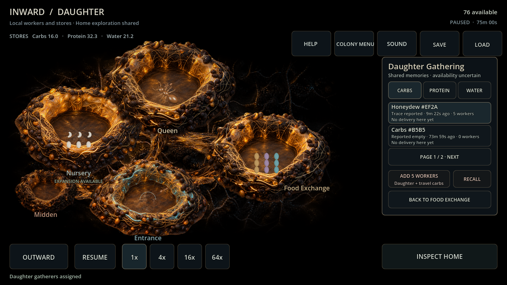
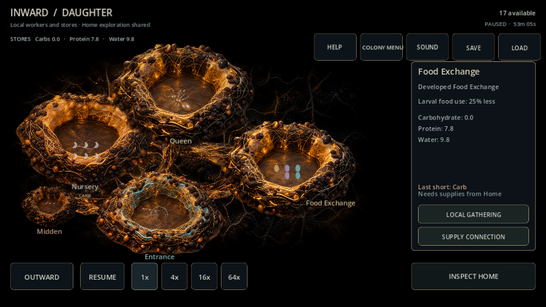

> **ARCHIVE ONLY — frozen 2026-10-04.** Historical record; not an active plan, current contract or implementation instruction. Use the [current documentation](../../../README.md). Original path: `docs/DAUGHTER_GATHERING_EVALUATION.md`. Historical status and recommendations below apply only to their recorded build.

# Daughter-owned gathering — card 108

The daughter's Food Exchange now offers Local Gathering: shared dated resource memories, daughter-owned worker commitments and actual local receipts. Two rows per page and resource filters keep attention bounded; selecting/filtering/paging is free, changing page clears the previous unseen selection. Assign/Add five workers, Recheck and Recall use existing TrailSystem rules. Unknown memory/site/action or wrong pile rejects without spending. Food strain separates Local Gathering from the physical Home Supply Connection.

Ownership audit: TrailRoute origin and TrailSegment start already drive authoritative worker allocation, travel energy, captured adult phenotype, cargo/contamination, deposition, physical recall, losses and side investigations. Full restore reconciles each origin ledger/profile and segment. The same remembered source can have distinct Home/daughter routes and receipts; the underlying resource remains physically shared. Original initial colony-wide knowledge permits this browser. No normal world references, instantaneous stores or safe-source forecast were added. OUTWARD remains Home; broader local scouting and Home-owned producer/guest/defensive commands remain separate.

Four ordinary card-107 developed daughters continued for 1,200 simulated seconds after Stop After Trip. Existing Home known-source policy continued; daughter policy preferred returned non-empty evidence, assigned local gatherers with care left available, withdrew on delivered alarms, and periodically rechecked reported depletion. No injected workers/resources/knowledge or private path/safety choices. One already paid parent pack could finish normally before release. All four supply parties ended inactive; all four daughters received their own returned cargo and grew.

| Setting / seed | Final daughter adults | Local adult losses | Returned water | Returned carbohydrate sources |
| --- | ---: | ---: | ---: | --- |
| Backyard 482817 | 105 | 2 | 25.63 | Honeydew 8.93; rival-food 12.81; sheltered food 19.16 |
| Backyard 591 | 113 | 2 | 19.09 | Honeydew 8.94; rival-food 12.79; sheltered food 24.33 |
| Garden Edge 482817 | 97 | 2 | 48.00 | Honeydew 8.92; rival-food 12.74; sheltered food 23.78 |
| Garden Edge 591 | 129 | 2 | 37.06 | Honeydew 8.91; rival-food 12.77; sheltered food 36.00 |

These runs demonstrate real independent intake, shared resource competition and consequential journey risk. They do not establish indefinite self-sufficiency, complete independent exploration/defense or session balance. Outbound/receipt/final snapshots restore exactly; local resources stay finite/nonnegative. [Raw report](../../../evidence/card108_gathering.json). Reproduce ordinary evaluations 104→108 in order.

Verification: **29 focused behavior checks** covering own labor/energy, malformed/unknown/poor labor gates, real intake/contamination, no hidden availability refresh, independent same-source routes/receipts, strict ownership saves, returned depletion/recheck, idle-versus-away recall, detached browsing and page selection. Final full suite **6,507 checks / zero failures or script errors**. Godot 4.7.2 Windows import/Main 90 passed. Compatibility / RX 6650 XT actual mouse 1280×720 and touch 900×600 passed local assignment/recall, filters/pages/back, pile reset and separated shortage controls; frames inspected, clean shutdown. Mobile/session targets remain tabled.

