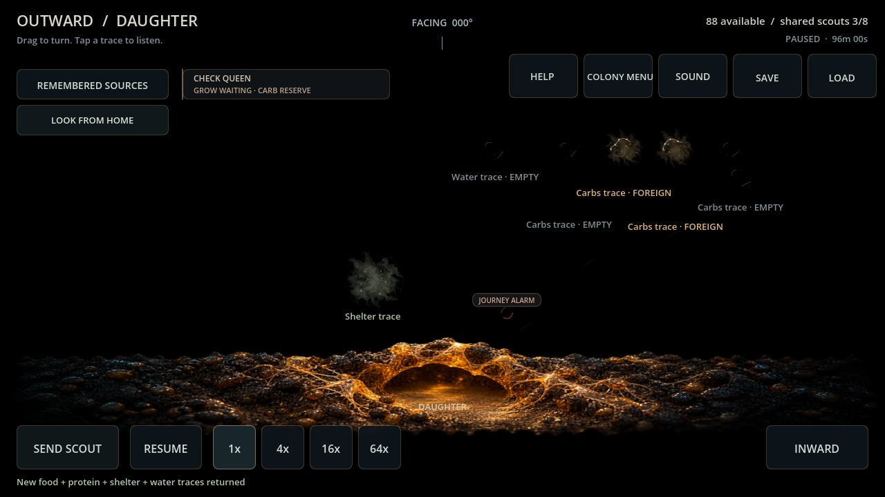
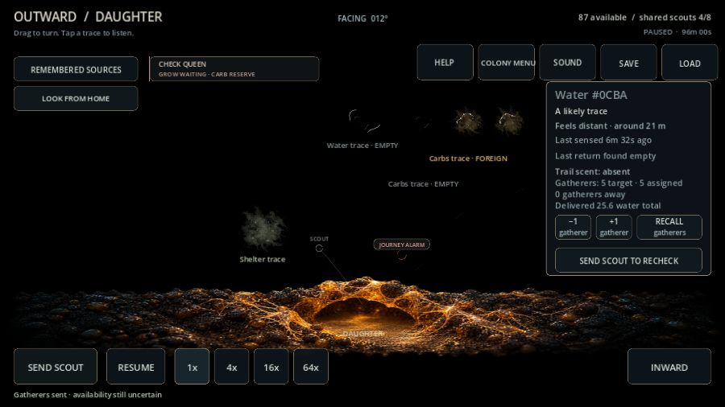

> **ARCHIVE ONLY — frozen 2026-10-04.** Historical record; not an active plan, current contract or implementation instruction. Use the [current documentation](../../../README.md). Original path: `docs/DAUGHTER_OUTWARD_EVALUATION.md`. Historical status and recommendations below apply only to their recorded build.

# Daughter OUTWARD attention — card 110

Both normal modes retain the attended pile. Look From Daughter/Home switches free attention; the sensory panorama projects shared returned memories from that entrance, with only its routes/scout memories/resources. The heading and entrance name the pile, and the detailed scout cap is explicitly shared. Selection/facing/gesture/browser resets prevent stale context; commands independently reject cross-origin scout/route IDs and non-food connections.

Daughter Send Scout dispatches one local worker toward the viewed direction to seek a new source; its named memory may be recalled physically. Shared resource/site memories permit deliberate local rechecks. Gathering, intake and losses remain real and origin-owned. Home standing priorities/recovery watch, producer tending, founding and paid survey/defenders stay gated until separately audited. Local returned alarms/evidence and recall remain available; no live remote truth or new saved view state.

Four ordinary paid card-108 daughters continued with Home effort turned off through normal commands. Each dispatched a manual local search, deliberately requested recall after 600 seconds, returned after 1,199.75 seconds total, and gave an own-water gathering order. Every 0.25-second step matched a JSON-restored twin, including 120 seconds of following gathering. All searches returned; no new local scout deaths. Their shared world memories were already extensive, so these trials exercise honest continued search/recall, not novel-source yield.

| Setting / seed | Departed at | Physical return at | Final daughter adults | Exact continuation |
| --- | ---: | ---: | ---: | --- |
| Backyard 482817 | 5760 | 6959.75 | 113 | yes |
| Backyard 591 | 6850 | 8049.75 | 121 | yes |
| Garden Edge 482817 | 6195 | 7394.75 | 105 | yes |
| Garden Edge 591 | 5955 | 7154.75 | 137 | yes |

[Raw report](../../../evidence/card110_outward.json). Reproduce ordinary 104→108 then evaluate_daughter_outward.gd. No resources/workers/memories were injected and no rates changed. Broader standing exploration, local paid defense, independent reproduction and indefinite self-sufficiency remain later scope.

Verification: **21 focused checks** for origin-relative projection, Home-order gates, own manual search/travel, stale cross-pile scout/route IDs, separate same-source routes, real recheck/recall and exact restore, free navigation/reset/load. Final full suite **6,604 checks / zero failures or script errors**. Windows Godot 4.7.2 import/Main 90 passed. Compatibility / RX 6650 XT actual mouse 1280×720 and touch 900×600 passed switch/dispatch/recall, remembered-water filters/focus/recheck, own gathering and same-pile mode switching. Frames inspected; clean shutdown. Mobile/session targets remain tabled.

