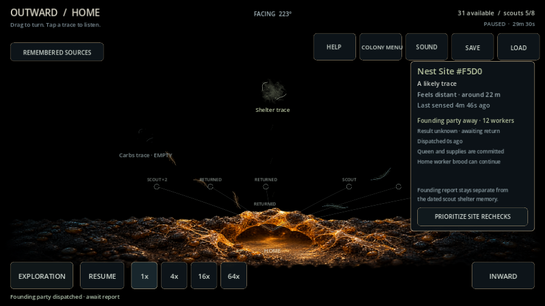
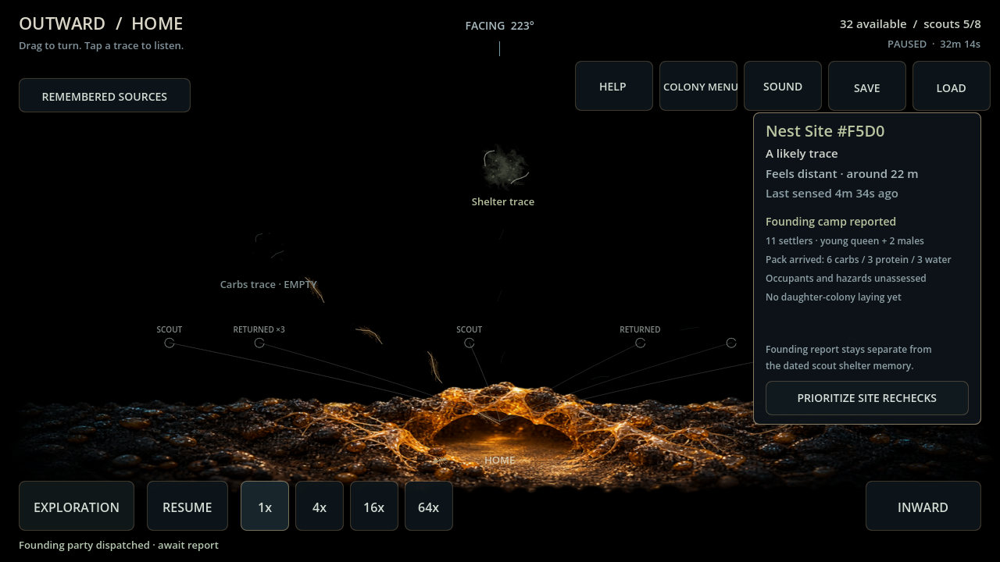

> **ARCHIVE ONLY — frozen 2026-10-04.** Historical record; not an active plan, current contract or implementation instruction. Use the [current documentation](../../../README.md). Original path: `docs/FOUNDING_CAMP_EVALUATION.md`. Historical status and recommendations below apply only to their recorded build.

# Physical founding camp evaluation

Godot 4.7.2 / Windows Compatibility / AMD RX 6650 XT. Four fresh ordinary colonies follow the previous paid-growth/returned-source policy, raise a reproductive group, then request founding from the returned Shelter identity. No worker/food injection, hidden target selection or suppressed ordinary scout losses. Commands pause for ten-second exact JSON continuation windows at each physical phase.

| Setting / seed | Departure (s) | Home report (s) | Journey + preparation (s) | Settlers committed | Active Home queens |
| --- | ---: | ---: | ---: | ---: | ---: |
| backyard_slice / 482817 | 1770.0 | 1933.5 | 163.5 | 11 | 1 |
| backyard_slice / 591 | 2770.0 | 2933.0 | 163.0 | 11 | 1 |
| garden_edge / 482817 | 2205.0 | 2368.5 | 163.5 | 11 | 1 |
| garden_edge / 591 | 1975.0 | 2137.5 | 162.5 | 11 | 1 |

All four paid the twelve-worker pack/energy and returned one messenger, preserving real ledger ownership and exact outbound/preparation/messenger/ready continuation. Ordinary parent ecology/traffic continues independently, including scout losses. Shelter arrival/preparation is private; only the actual messenger supplies the result.

37 focused checks include atomic rejections, no food traffic on the founding route, invalid/orphan save rejection, stale physical shelter failure, whole-party/group/pack return with contamination, legacy defaults and pause/all speeds. Final full suite: 6,379 checks, zero failures/script errors. Final import and 90-frame Main passed. Standard/compact actual mouse/touch funding and private-arrival/returned-camp graphics passed without shutdown warnings.

[Raw ordinary trials](../../../evidence/card104_founding.json).

Boundary: a supported physical camp, with eleven settlers still owned by the original Home commitment. No active daughter queen, worker duplication or fertile/mating declaration. Camp activation/local brood and supply transfers follow in the next bounded section. This first expedition adds no cancellation, camp food upkeep/mortality or occupant/hazard assessment. The remembered dashed connection is known intent; actual pheromone/familiarity only rises with home return. Mobile and session targets remain tabled; human playtesting is open.
