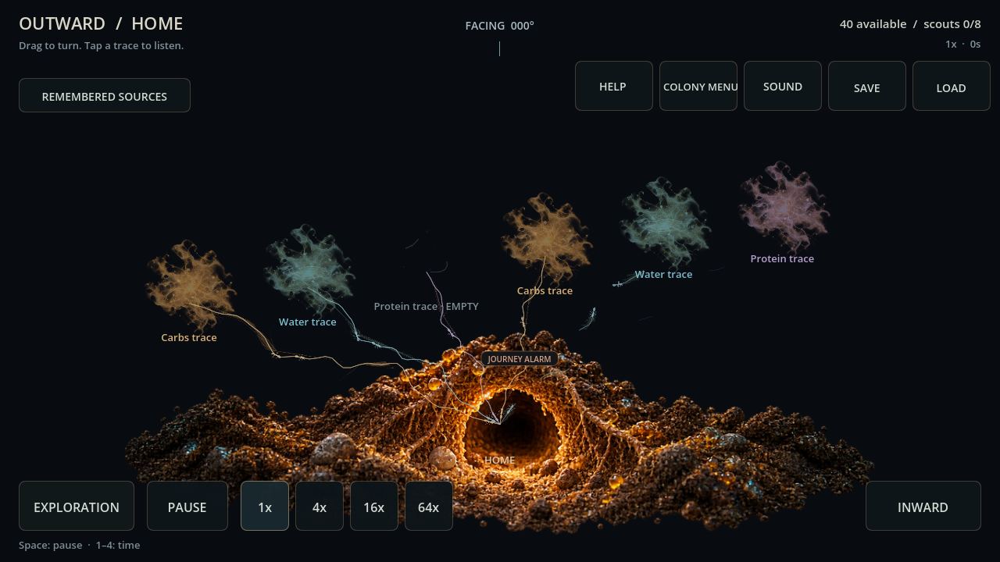
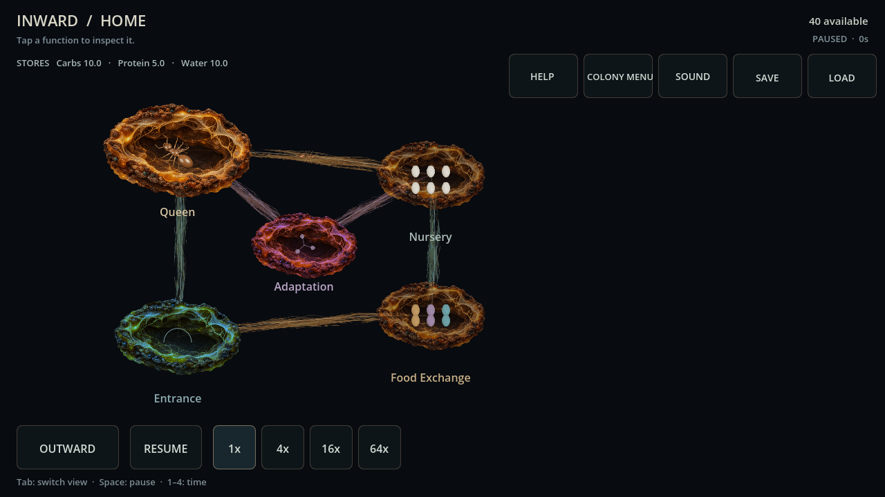
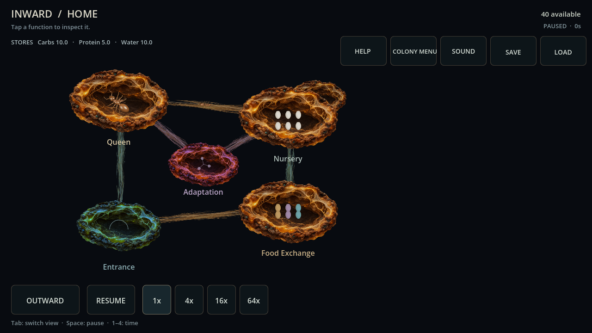
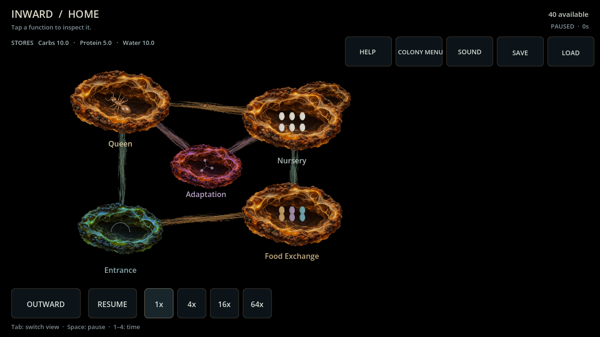
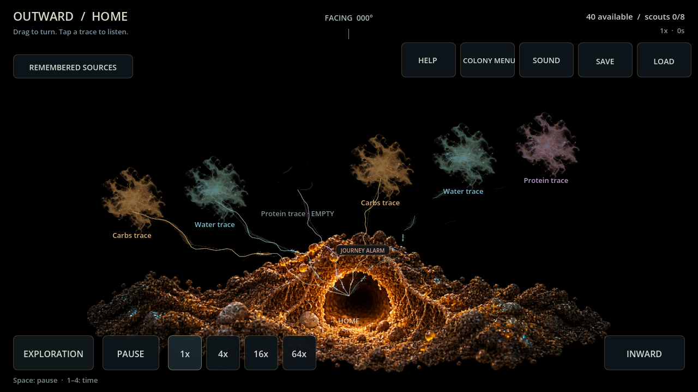

> **ARCHIVE ONLY — frozen 2026-10-04.** Historical record; not an active plan, current contract or implementation instruction. Use the [current documentation](../../../README.md). Original path: `docs/TEXTURED_ART_EVALUATION.md`. Historical status and recommendations below apply only to their recorded build.

# Textured colony art — card 089

The player's new bioluminescent references replace the incremental primitive treatment with sculpted empty chamber shells, rich Home substrate, fine sensory lace and shared framed controls. Original Blender queen/brood meshes and the walking worker atlas supply separate contents. Primitive chambers grow/brighten during existing development; Nursery capacity expansion adds a second lobe. This remains a functional network, not a tunnel floorplan.

## Verification

- Final full headless suite: **6003 checks, zero failures**. Targeted iteration: 280 presentation/input/privacy checks, zero failures; the final suite also includes the added lobe-selection checks.
- Final resource import and 90-frame Main smoke exited zero without script/resource errors. Sandbox user-log/editor-settings/certificate warnings remain environmental.
- Inspected standard/compact exterior stress, primitive/developed/expanded interiors, selected expanded Nursery, Adaptation Web and Sound overlay. Resource-caption/depletion/selection rules remain intact. Fixed imported-dimension entrance sampling and kept Home beneath returned alarms; protected larger worker sprites from organ labels.
- Both detached graphics fixtures and the separate progression probe preserved authoritative snapshots/RNG exactly. The progression screenshots project existing approved construction states; they do not perform unpaid construction in the run. Existing paid development/capacity tests remain passing.

## Desktop comparison

Same Godot 4.7.2 Compatibility engine, Ryzen 7 7800X3D, Radeon RX 6650 XT, OpenGL 3.3 driver 26.8.1.260806, 240-Hz display. Before is isolated commit `287f473` (088); after is final 089. Warm-up 0.8s, sampling 2s per case. [Raw paired measurements](../../../evidence/card089_graphics.json) retain dimensions, timing tails and texture counters. Samples are short whole-frame intervals, not separate GPU timings or release certification.

| Unpaced workload | Before p95 ms | After p95 ms | Before/after p99 ms | Before/after draw calls |
| --- | ---: | ---: | ---: | ---: |
| Quiet OUTWARD | 0.459 | 0.628 | 0.519 / 0.746 | 39 / 36 |
| Normal OUTWARD | 1.577 | 1.931 | 1.719 / 2.196 | 187 / 189 |
| Six-link OUTWARD, standard | 2.796 | 3.261 | 3.412 / 3.787 | 331 / 342 |
| Six-link OUTWARD, compact | 2.965 | 3.083 | 3.516 / 3.746 | 331 / 342 |
| Six-link OUTWARD, larger | 2.715 | 2.846 | 3.267 / 3.101 | 331 / 342 |
| Busy INWARD, standard | 1.512 | 1.841 | 1.809 / 1.950 | 191 / 196 |
| Busy INWARD, compact | 1.585 | 1.758 | 1.906 / 1.970 | 187 / 194 |
| Busy INWARD, larger | 1.438 | 1.813 | 1.696 / 1.957 | 187 / 196 |
| Quiet live 64x | 0.505 | 0.638 | 0.606 / 0.697 | 39 / 36 |

VSync stress p95 rose from 4.317 to 5.936ms (p99 4.382 to 7.461ms); retain the scheduling variability rather than claiming perfect pacing. Monitored texture memory rose about **7.4–7.6 MiB**. There is substantial headroom on this desktop at the provisional 60-FPS goal, with a measurable art cost. No bloom, lights, volumetrics, runtime 3D or extra agent nodes are required.

Requests were 1280x720, 900x600 and 1920x1080. Compact capture is 900x506; the logical viewport stays 1280x720. Raw texture-size accessor values after resizing are not asserted to be physical GPU resolutions. Exterior fixtures cover strong/weak/memory/empty/returned-alarm cases; busy INWARD uses known local job pressure. Live 1x/16x/64x samples use a quiet fresh colony, not a busy established simulation. Earlier erroneous/in-progress captures were discarded; final runs were sequential with authoring/headless gates finished.

## Actual game captures

[Developed before expansion](../../../evidence/card089_inward_developed.png), [compact expanded Nursery](../../../evidence/card089_inward_expanded_900.png), [compact exterior](../../../evidence/card089_outward_900.png).

## Remaining boundaries

Distinct chamber material variants and report-derived object impressions can expand this modular direction. Full release visual quality, minimum supported hardware, long-session memory, busy live-colony stress, thermal behavior and Android performance remain open. Pixel 7 Pro is the player's first real-device target, not a measured minimum specification; SDK/export/device setup is pending. No paid tool/plugin was added. [Asset provenance and generation prompts](../../../../assets/graphics/colony/README.md) are checked in.

## Black-field follow-up

The player chose pure black instead of inherited blue-black. Both normal views and viewport clear now use RGB 0/0/0, with existing local illumination and framed controls retained. Fresh standard/compact captures and pixel inspection passed; the full suite remains 6003 checks / zero failures, with clean script/resource import, Main smoke and unchanged probe snapshot/RNG. The preceding timing comparison belongs to the textured-art pass; no new performance claim is made for this color-only follow-up.

