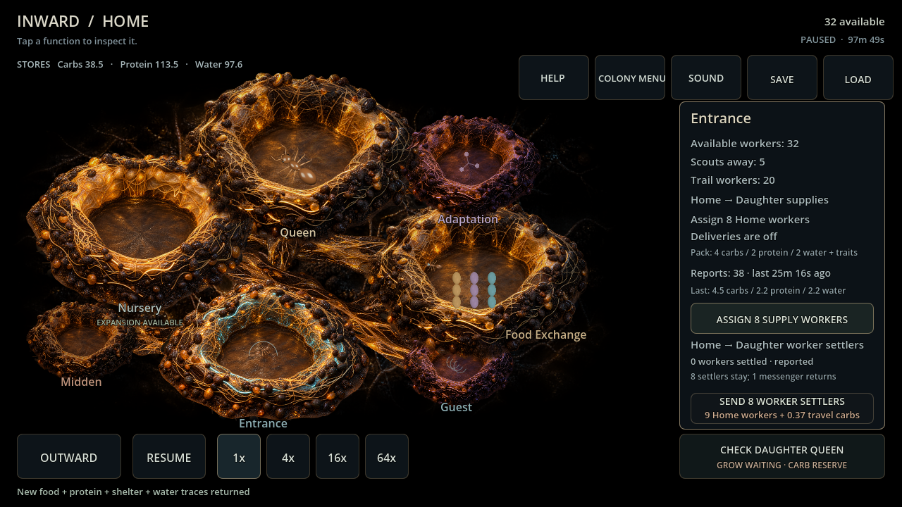
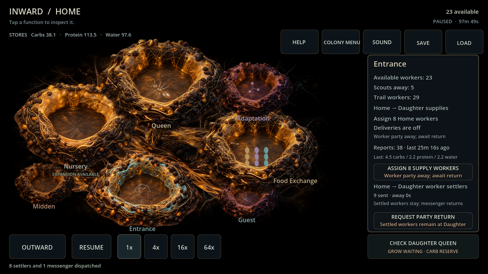
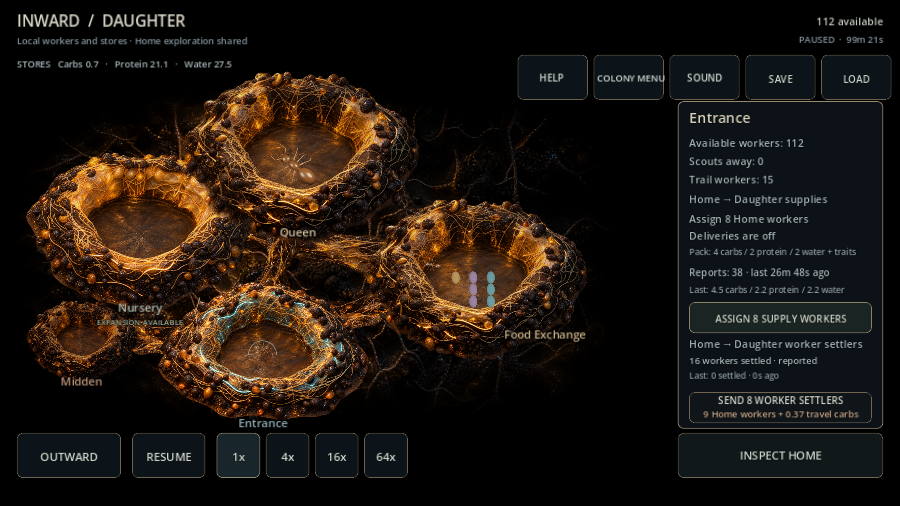

> **ARCHIVE ONLY — frozen 2026-10-04.** Historical record; not an active plan, current contract or implementation instruction. Use the [current documentation](../../../README.md). Original path: `docs/WORKER_REINFORCEMENT_EVALUATION.md`. Historical status and recommendations below apply only to their recorded build.

# Daughter worker reinforcement — card 115

Godot 4.7.2, Windows, Compatibility renderer / Radeon RX 6650 XT. Existing paid card113 saves; Backyard and Garden Edge, seeds 482817/591. No injected workers, stores or danger changes in ordinary trials.

Each ordered two eight-settler migrations, then physically recalled a third party after 2.5 seconds. Nine Home workers and trait/terrain-adjusted travel carbs were funded per departure. Each real daughter arrival transferred eight; only the returning messenger confirmed settlement. Recall transferred zero and consumed its already paid travel food.

| Scenario / seed | One leg | Total travel carbs (three departures) | Actual migrants | Moved adult profiles | Daughter workers at end |
| --- | --- | --- | --- | --- | --- |
| Backyard / 482817 | 21.75s | 1.10274 | 16 | 10 baseline, 4 Load, 2 Load+Persistent | 129 |
| Backyard / 591 | 21.50s | 1.11181 | 16 | 11 baseline, 3 Load, 2 Load+Persistent | 135 |
| Garden / 482817 | 21.75s | 1.08319 | 16 | 10 baseline, 3 Load, 2 Load+Persistent+Tolerance, 1 Load+Tolerance | 121 |
| Garden / 591 | 21.25s | 1.04940 | 16 | 12 baseline, 2 Load, 1 Load+Persistent+Tolerance, 1 Load+Persistent | 144 |

All four had exact JSON-restored continuation at every travel/return tick, conserved colony population including births/losses, equal Home exports/Daughter imports, sixteen reported settlers and a latest zero-settled recall report. Existing supply cargo/receipts remain separate. Worker profiles use card105 deterministic aggregate composition at ownership handoff; existing adult jobs do not reserve individual genomes. Arriving earned traits preserve prerequisites but cannot rewrite the daughter queen.

Full regression: **6,970 checks, zero failures**, including 44 focused reinforcement checks plus suite completion. Covers pause/speed equivalence, immediate/partial recall, repeated transfers and supply reuse, old saves, malformed/orphan histories, overlapping profiles and a new trait gained after founding. Editor import and Main 90-frame headless smoke passed without script/runtime errors. Actual mouse at 1280×720 and touch at 900×600 dispatched, recalled and inspected results; rendered panels inspected for fit. OUTWARD retains dispatched count while away instead of disclosing the private one-messenger return phase.

Limits: one original connection, first daughter, manually exclusive supply/reinforcement, no transport casualties or Daughter→Home migration. Initial shared internal knowledge remains permitted by Part3§89. Rates, session target, mobile packaging and full mating/lineages remain outside this card.
